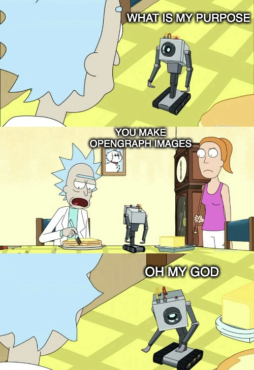

<h2 align="center"> ━━━━━━  ❖  ━━━━━━ </h2>

<!-- BADGES -->

   

   
      

      

   
   
   
    

---

### ❖ Information 

Og exists to generate OpenGraph images for my blog

Large parts of the code were taken directly from [crates_io_og_image](https://github.com/rust-lang/crates_io_og_image)
under the MIT License

---

### ❖ What's New?

0.3.0 - Center aligned main text

---

   

